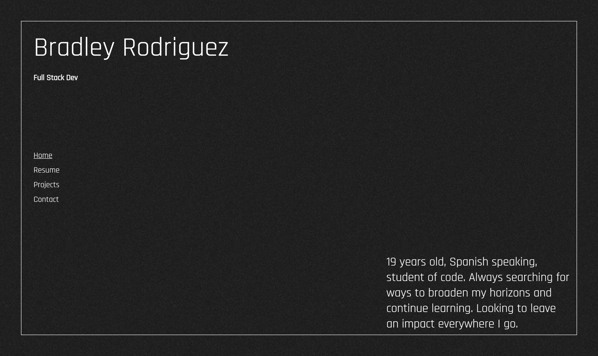

# Bradley Rodriguez's Portfolio

[](https://opensource.org/licenses/other)

## Description

A portfolio made by Bradley. Includes an about/landing page, resume, project, and contact section.

## Table of Contents (Optional)

- [Installation](#installation)
- [Usage](#usage)
- [Questions](#questions)

## Installation

To install necessary depenencies, run the follwing command:

```md
npm i, npm run start.
```

## Usage

https://bradley-rodriguez-portfolio.herokuapp.com/#/



You can use the app by the link in this README file or the environment tab on github. Navigate the site by using the Home, resume, project, and contact tabs on the site.

## How to Contribute

Feel free to take any ideas !


## Questions?

Reach out to me!

-GitHub: [HeyItsBradley](https://github.com/HeyItsBradley)

-Email: bradleyrodriguez77@gmail.com
